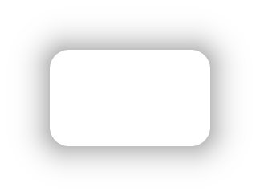
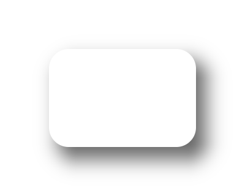

# react-native-figma-shadow

> **Status: alpha (`0.1.0-alpha.x`).** The shared C++ core is tested; the native
> iOS/Android layers are still being shaken out on real devices. Every release is
> published to the `latest` (and `alpha`) dist-tag, so `npm install
> react-native-figma-shadow` gets the newest build. Expect rough edges — feedback
> welcome.

Paste a CSS `box-shadow` — the exact string Figma's **Copy as CSS** produces, or
what you already use on the web — and get a **pixel-identical** shadow on iOS and
Android.

```tsx
import { Shadow } from 'react-native-figma-shadow';

<Shadow shadow="0px 4px 20px 0px rgba(0, 0, 0, 0.15)" borderRadius={16}>
  <Card />
</Shadow>;
```

- **One renderer, both platforms.** The shadow is rasterized by a shared C++
  core (an analytic Gaussian convolution of a rounded rectangle). iOS and Android
  run the same code and produce the same bytes — no `CALayer` blur vs `elevation`
  mismatch.
- **Zero peer dependencies.** No Skia, no `react-native-svg`. Adds roughly
  50–100 KB to your app download.
- **New Architecture native component** (Fabric). Requires React Native 0.76+
  with the New Architecture enabled.
- **Real CSS semantics:** multiple comma-separated shadows, `inset`, spread,
  negative spread, and any CSS color (`#rgb`, `#rrggbbaa`, `rgb()/rgba()`,
  `hsl()/hsla()`, named colors).

| `0 0 20px rgba(0,0,0,.5)` | `8px 10px 16px rgba(0,0,0,.6)` | `inset 0 8px 12px rgba(0,0,0,.7)` |
| :---: | :---: | :---: |
|  |  |  |

<sub>Rendered by the shared C++ core — byte-for-byte identical output feeds both the iOS `CALayer` and the Android `Canvas`.</sub>

## Why the numbers finally match

"Blur" means different things across systems:

| System                    | `blur` value is…            |
| ------------------------- | --------------------------- |
| Figma / CSS `box-shadow`  | ≈ 2× the Gaussian σ         |
| iOS `shadowRadius`        | ≈ the Gaussian σ            |
| Android `elevation`       | not configurable            |

This library normalizes everything to the CSS/Figma definition (`σ = blur / 2`),
so the number you paste is the number you get.

## Install

```sh
npm install react-native-figma-shadow
# or: yarn add react-native-figma-shadow   (Yarn 1 or Yarn 3+/Berry)
cd ios && pod install
```

The C++ core is compiled into your app automatically by the New Architecture
build (CocoaPods on iOS, CMake/`externalNativeBuild` on Android). There is no
extra setup step, no postinstall script, and no peer dependency beyond
`react` / `react-native` themselves.

### Yarn 3+ (Berry)

The package ships a modern `exports` map and installs cleanly under Yarn Berry.
As with every React Native native module, use the **`node-modules` linker** —
Metro, CocoaPods, and Gradle autolinking all expect a real `node_modules` tree,
so Yarn PnP is not supported by the RN toolchain:

```yaml
# .yarnrc.yml
nodeLinker: node-modules
```

## API

### `<Shadow>`

| Prop                                                                             | Type      | Notes                                                        |
| -------------------------------------------------------------------------------- | --------- | ----------------------------------------------------------- |
| `shadow`                                                                         | `string`  | A CSS `box-shadow` value. `box-shadow:` prefix and trailing `;` are tolerated. |
| `borderRadius`                                                                   | `number`  | Uniform corner radius of the shadow shape. Match your child. |
| `borderTopLeftRadius` / `borderTopRightRadius` / `borderBottomRightRadius` / `borderBottomLeftRadius` | `number` | Per-corner override.                                         |
| `backgroundColor`                                                                | `string`  | Fill painted inside the content box, **below** an inset shadow and below children (use this instead of a background on the child for CSS-correct inset shadows). |
| `highQuality`                                                                    | `boolean` | Opt into the slower exact rounded-corner quadrature. Default `false`. |
| `style`                                                                          | `ViewStyle` | Applied to the outer layout box.                            |

```tsx
// multiple shadows — comma-separated, straight from Figma / CSS
<Shadow
  shadow="0 2px 4px rgba(0,0,0,.10), 0 12px 32px rgba(0,0,0,.14)"
  borderRadius={16}
>
  <Card />
</Shadow>

// inner shadow (Figma "Inner shadow")
<Shadow shadow="inset 0 2px 8px rgba(0,0,0,0.25)" borderRadius={12} backgroundColor="#fff">
  <TextInput />
</Shadow>

// per-corner radius
<Shadow
  shadow="0 8px 24px rgba(0,0,0,.12)"
  borderTopLeftRadius={16}
  borderTopRightRadius={16}
>
  <Sheet />
</Shadow>
```

### Helpers

```ts
import { parseBoxShadow, computeBleed } from 'react-native-figma-shadow';

parseBoxShadow('0 4px 20px rgba(0,0,0,.15)');
// [{ offsetX: 0, offsetY: 4, blur: 20, spread: 0, inset: false }]

computeBleed(parseBoxShadow('0 4px 20px rgba(0,0,0,.15)'));
// { left: 30, top: 30, right: 30, bottom: 34 }
```

## How it works

1. `<Shadow>` parses the value on the JS side only to compute the **bleed** — how
   far the shadow extends past the element box — and reserves that space with
   negative margins so layout stays neutral.
2. The native Fabric view (`FigmaShadowView`) hands the raw `box-shadow` string,
   the content size, corner radii, bleed and pixel ratio to the shared C++
   `render()`.
3. C++ parses the declaration, rasterizes every layer into one premultiplied
   RGBA8888 bitmap, and memoizes it (identical requests — e.g. every row of a
   list — reuse one bitmap).
4. iOS sets the bitmap as a `CALayer`'s `contents`; Android blits it in
   `dispatchDraw` behind the children. Neither platform does any blur math.

## How it compares

| | **figma-shadow** | core RN `boxShadow` | [shadow-2] | [Skia] `<Shadow>` | [fast-shadow] | [drop-shadow] |
|---|:---:|:---:|:---:|:---:|:---:|:---:|
| Identical on iOS **and** Android | ✅ one rasterizer | ⚠️ different blur per platform | ⚠️ SVG, close-ish | ✅ one engine | ⚠️ tuned, not exact | ❌ iOS≠Android |
| Paste a CSS / Figma `box-shadow` string | ✅ | ✅ | ❌ props | ❌ props | ❌ props | ❌ props |
| True Gaussian blur | ✅ analytic | ✅ | ❌ gradient approx | ✅ | ✅ native | ✅ native |
| Multiple shadows · `inset` · spread | ✅·✅·✅ | ✅·✅·✅ | ❌·❌·✅ | ✅·✅·⚠️ | ❌·❌·❌ | ❌·❌·❌ |
| Peer dependencies | **none** | none | `react-native-svg` | `@shopify/react-native-skia` | none | none |
| Added download / arch | **~50–100 KB** | 0 | ~0.5–1 MB | **~4–8 MB** | ~10–20 KB | ~10–20 KB |
| List caching (identical rows → 1 bitmap) | ✅ | ❌ | ❌ | ❌ | ❌ | ❌ |
| Decorates a normal view (no `<Canvas>`) | ✅ | ✅ | ✅ | ❌ wrap in Canvas | ✅ | ✅ |
| Android blur engine | portable C++ | RenderNode | SVG | Skia | `setShadowLayer` | RenderScript *(removed in API 31)* |
| New Architecture | ✅ required | ✅ | ✅ | ✅ | interop | legacy |

[shadow-2]: https://www.npmjs.com/package/react-native-shadow-2
[Skia]: https://shopify.github.io/react-native-skia/
[fast-shadow]: https://www.npmjs.com/package/react-native-fast-shadow
[drop-shadow]: https://www.npmjs.com/package/react-native-drop-shadow

**When this package is the right call**

- A designer hands you `box-shadow: …` and it has to match the mock on both platforms.
- Long lists / grids of identically-shadowed cards (the cache pays for itself once).
- You don't want to ship Skia (multi-MB) just for shadows.

**When to use something else**

- **Core `boxShadow`** if "roughly right on each platform" is good enough — it's
  free, built in, and takes the same CSS string. This package exists for when
  *"roughly"* isn't acceptable and for the list-caching.
- **Skia** if you're already using it, or need shadows on arbitrary drawn/Canvas
  content.
- **shadow-2** if you're still on the old architecture (this package is New-Arch only).

A fuller breakdown is in [docs/COMPARISON.md](docs/COMPARISON.md).

## Limitations

- **Shape shadows only.** The shadow follows the `borderRadius` you give it, not
  the actual alpha of arbitrary content (text, transparent PNGs). `drop-shadow`
  that hugs content alpha is not in this version.
- **New Architecture required** (RN 0.76+). No legacy-architecture fallback.
- First render of a given shadow happens on a background thread and appears a
  frame or two later; after that it is cached.
- The `backgroundColor` fill uses the top-left radius for all four corners when
  per-corner radii differ (the shadow itself is always exact).

## License

MIT
